<picture>
  <source media="(max-width: 600px) and (prefers-color-scheme: dark)" srcset="assets/hero-mobile-dark.svg" />
  <source media="(max-width: 600px) and (prefers-color-scheme: light)" srcset="assets/hero-mobile-light.svg" />
  <source media="(prefers-color-scheme: dark)" srcset="assets/hero-dark.svg" />
  <source media="(prefers-color-scheme: light)" srcset="assets/hero-light.svg" />
  
</picture>

<p align="center">
  
  <a href="https://www.linkedin.com/in/oceankumar/"></a>
  <a href="https://github.com/oceankumar?tab=repositories"></a>
</p>

## `> whoami`

I build **AI applications and the systems around them**: retrieval pipelines, LLM integrations, data workflows, APIs, and interfaces people can actually use.

```text
ocean@build-lab:~$ cat identity
├── focus      AI product development + full-stack engineering
├── systems    RAG · retrieval · agents · intelligent automation
├── approach   source-grounded answers, traceable pipelines, useful UX
└── rule       useful product > impressive demo
```

Current obsession: making AI products feel less like chatbots and more like dependable software.

## `> featured_systems`

### 01 / ContextIQ
**Vectorless RAG Knowledge Assistant** · `private for now`

Upload documents. Ask questions. Get source-grounded answers with citations.

```text
parse → chunk → index → retrieve → rerank → generate
```

PostgreSQL full-text search, metadata filtering, query expansion, relevance ranking, and LLM reranking select the context that reaches the model. Citations and a traceable retrieval pipeline keep answers connected to their sources.

**Design principle:** relevant context first; generation second.

### 02 / [InternAI](https://github.com/oceankumar/Internship-Intelligence-Platform)
**AI Internship Intelligence Platform** · `FastAPI / Next.js / PostgreSQL`

A searchable workspace that brings internship discovery, explainable matching, and application tracking together.

```text
discover → ingest → normalize → deduplicate → score → filter → match
```

Multi-source ingestion, evidence-aware trust and relevance scoring, eligibility checks, paid-role and experience filters, plus optional validated AI classification. Missing information stays unknown; a successful fetch is only the start of a useful result.

[Explore the architecture and implementation →](https://github.com/oceankumar/Internship-Intelligence-Platform#architecture)

**Also building:** [ParkEase](https://github.com/oceankumar/ParkEase) — a Node.js / MongoDB parking management system with QR entry and exit, slot allocation, bookings, billing, and analytics.

## `> neural_stack`

**AI / LLM**<br />
RAG pipelines · LLM APIs · structured outputs · tool calling · query expansion · reranking · context management · document processing · agents<br />
Local model workflows with **Ollama / LM Studio**.

**Backend / data**<br />
<br />
REST APIs · SQL · ingestion · normalization · data pipelines

**Frontend**<br />


<details>
<summary><b>Cloud / tools</b> — the rest of the workbench</summary>
<br />

</details>

## `> signal_history`

**Adhyaapan · AI Product Development & Web Engineering Intern**<br />
AI product prototyping, LLM integrations, backend services, and data workflows; building across the frontend, backend, and data layers.

**Previously: Handshake · LLM Trainer / AI Response Evaluation**<br />
Evaluated accuracy, relevance, clarity, and guideline adherence in model responses; reviewed structured AI training data.

**B.Tech · Computer Science & Artificial Intelligence**<br />
Newton School of Technology · 2025–2029

<details>
<summary><b>Community / leadership</b></summary>
<br />
Microsoft Student Ambassador · Former Google Student Ambassador · Lead Designer, GDG Rishihood University · Hacktoberfest 2025 Super Contributor · 10+ open-source pull requests · HPAIR ’26 Selected Delegate
</details>

## `> telemetry`

<picture>
  <source media="(prefers-color-scheme: dark)" srcset="https://raw.githubusercontent.com/oceankumar/OceanKumar/output/telemetry-dark.svg?v=1" />
  <source media="(prefers-color-scheme: light)" srcset="https://raw.githubusercontent.com/oceankumar/OceanKumar/output/telemetry-light.svg?v=1" />
  
</picture>

<picture>
  <source media="(prefers-color-scheme: dark)" srcset="https://raw.githubusercontent.com/oceankumar/OceanKumar/output/languages-dark.svg?v=1" />
  <source media="(prefers-color-scheme: light)" srcset="https://raw.githubusercontent.com/oceankumar/OceanKumar/output/languages-light.svg?v=1" />
  
</picture>

<p align="center">
  <picture>
    <source media="(prefers-color-scheme: dark)" srcset="https://streak-stats.demolab.com?user=oceankumar&amp;hide_border=true&amp;background=0D1117&amp;ring=B89AFF&amp;fire=67E8F9&amp;currStreakNum=F0F6FC&amp;currStreakLabel=B89AFF&amp;sideNums=F0F6FC&amp;sideLabels=919BAB&amp;dates=919BAB" />
    
  </picture>
</p>

## `> contribution_protocol`

<picture>
  <source media="(prefers-color-scheme: dark)" srcset="https://raw.githubusercontent.com/oceankumar/OceanKumar/output/github-contribution-grid-snake-dark.svg?v=1" />
  <source media="(prefers-color-scheme: light)" srcset="https://raw.githubusercontent.com/oceankumar/OceanKumar/output/github-contribution-grid-snake.svg?v=1" />
  
</picture>

<picture>
  <source media="(prefers-color-scheme: dark)" srcset="https://raw.githubusercontent.com/oceankumar/OceanKumar/output/activity-dark.svg?v=1" />
  <source media="(prefers-color-scheme: light)" srcset="https://raw.githubusercontent.com/oceankumar/OceanKumar/output/activity-light.svg?v=1" />
  
</picture>

<p align="center"><sub>Telemetry, languages, activity graph, and snake refresh daily via <a href="https://github.com/oceankumar/OceanKumar/actions/workflows/snake.yml">GitHub Actions</a>. Language share reflects public repository bytes, not expertise.</sub></p>

<details>
<summary><b>&gt; operating_system</b> — a small implementation detail</summary>

```python
class Ocean:
    mode = "BUILD"
    interests = ("AI products", "retrieval", "agents", "automation")
    rule = "Useful product > impressive demo"

    def execute(self, idea):
        return f"understand({idea}) → prototype → test → break → fix → ship → iterate"
```

</details>

---

<p align="center"><code>// ideas are cheap. execution leaves commits.</code></p>
