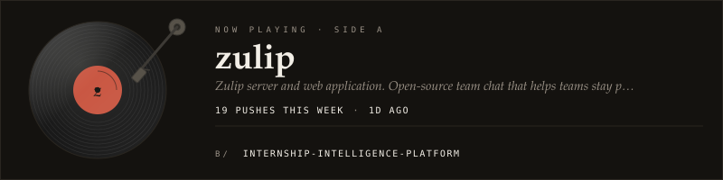

# Ocean Kumar

**AI Product Developer × Full-Stack** 
RAG · Agents · Retrieval · Automation

[LinkedIn ↗](https://www.linkedin.com/in/oceankumar/) &nbsp;·&nbsp; [GitHub ↗](https://github.com/oceankumar?tab=repositories) &nbsp;·&nbsp; [Email ↗](mailto:oceankumar107@gmail.com)

CS & AI student in India, building useful software across LLM integrations, APIs, and full-stack systems. A builder’s mindset, with a designer’s eye.

### Workbench

 

### Along the way

**Now** · AI Product Development & Web Engineering Intern @ Adhyaapan 
**Before** · LLM Trainer / AI Response Evaluation @ Handshake 
**Learning** · B.Tech CS & AI · Newton School of Technology · ’29

Microsoft Student Ambassador · GDG Lead Designer · HPAIR ’26 Selected Delegate · Hacktoberfest 2025 Super Contributor

### GitHub signal

<picture>
  <source media="(prefers-color-scheme: dark)" srcset="https://raw.githubusercontent.com/oceankumar/OceanKumar/output/languages-dark.svg?v=2" />
  <source media="(prefers-color-scheme: light)" srcset="https://raw.githubusercontent.com/oceankumar/OceanKumar/output/languages-light.svg?v=2" />
  
</picture>

<picture>
  <source media="(prefers-color-scheme: dark)" srcset="https://raw.githubusercontent.com/oceankumar/OceanKumar/output/github-contribution-grid-snake-dark.svg?v=1" />
  <source media="(prefers-color-scheme: light)" srcset="https://raw.githubusercontent.com/oceankumar/OceanKumar/output/github-contribution-grid-snake.svg?v=1" />
  
</picture>

Useful product &gt; impressive demo.
